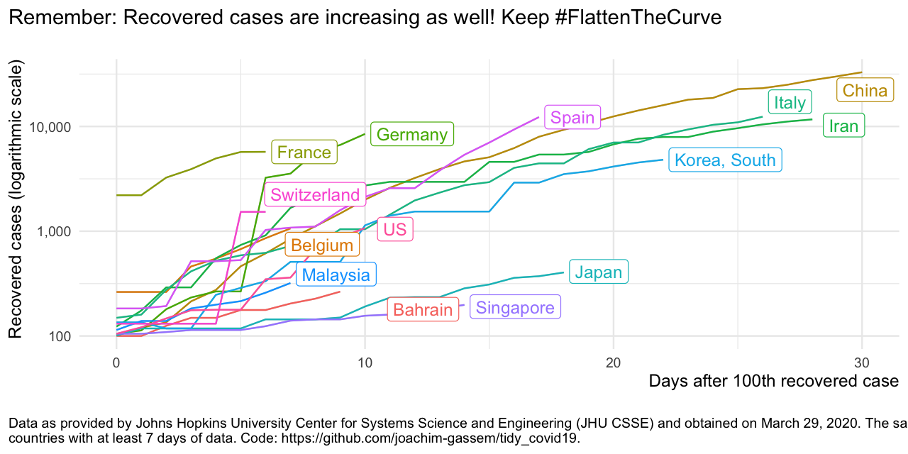
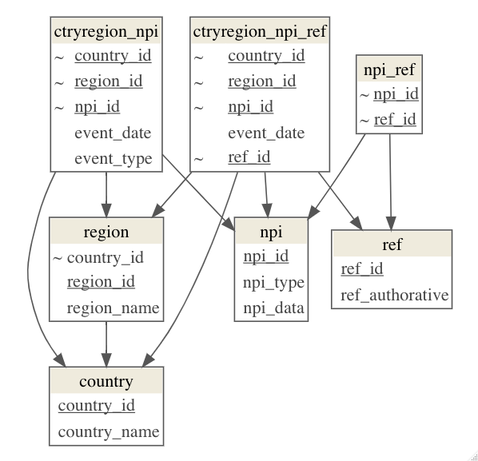

Joachim Gassen

# A repository for maintaining COVID-19 data in R

## Disclaimer

I am an applied economist studying the economic effects of regulatory
interventions on corporate transparency and leading the Open Science
Data Center (OSDC) of the [TRR 266 Accounting for
Transparency](https://accounting-for-transparency.de), wich is funded by
the German Science Foundation (DFG). The OSDC has the objective to make
research transparent in a way that others can contribute and
collaborate.

This is the spirit that motivated me to set up this repository. I am
clearly no epidemiologist so I will abstain from analyzing the spread of
the disease or estimating the effects of non-pharmaceutical
interventions. Instead this repository serves the purpose to facilitate
the use of various Covid-19 related data sources with a special focus on
non-pharmaceutical interventions as this type of data is closer to my
domain knowledge.

In that way, I hope that it might be helpful for others that are
interested in doing research on the Covid 19 pandemic by promoting the
benefits of open science.

## Blog post

[Click
here](https://joachim-gassen.github.io/2020/03/merge-covid-19-data-with-governmental-interventions-data/)
for the blog post that showcases some descriptive visuals to see what
one can do with the data retrieved by this project.

## Data

This repository is not containing any self-collected or generated data.
Instead it currently builds on three external, publicly available data
sources

  - The [Covid-19 data from the Johns Hopkins University CSSE
    team](https://github.com/CSSEGISandData/COVID-19). This data has
    developed to a standard resource for researchers and the general
    audience interested in assessing the global spreading of the virus.
  - The [Government measures dataset provided by the Assessment
    Capacities Project
    (ACAPS)](https://data.humdata.org/dataset/acaps-covid19-government-measures-dataset).
    These relatively new data allow researchers to study the effect of
    non-pharmaceutical interventions on the development of the virus.
  - Additional country level information provided by the [World
    Bank](https://data.worldbank.org). These data allow researchers to
    calculate per capita measures of the virus spread and to assess the
    association of macro-economic variables with the development of the
    virus.

## Code

The `code` directories contains the following R code files:

  - `import_jhu_csse_covid19_data.R` Imports the JHU CSSE data on the
    global spread of the Covid-19 pandemic, aggregates the data at the
    country level, and adds ISO3c country indicators. See [this blog
    post](https://joachim-gassen.github.io/2020/03/tidying-the-new-johns-hopkins-covid-19-datasests/)
    for more information on the code.
  - `import_acaps_npi.R` Imports the ACAPS Government measures data, and
    fixes some minor inconsistencies in the category labels.
  - `import_wbank_data.R` Imports current country-level World Bank data.
  - `merge_data.R` Merges data from the three data sources into a
    country-day panel data set.
  - `descriptive_analyses.R`: Generates some descriptive visualizations
    of the data. You can use it as a starting point for your own
    analyses.

## Alternative data sources for non-pharmaceutical interventions

As far as I can tell, there is no commonly accepted data repository for
non-pharmaceutical interventions yet. Besides the ACAPS repository
above, these are additional data sources that I identified (partly with
the help of the recent [data are plural
newsletter](https://tinyletter.com/data-is-plural/letters/data-is-plural-2020-03-25-edition)):

  - [An intiative by the Blavatnik School of Government, University of
    Oxford](https://www.bsg.ox.ac.uk/research/research-projects/oxford-covid-19-government-response-tracker)
  - [A project hosted by Rex W. Douglass, UC San
    Diego](https://github.com/rexdouglass/TIGR)
  - [A repository generated by a team in the recent German hackatron
    \#WeVsVirus](https://devpost.com/software/1757_flattenthecurve_predictivemodeling-tyeo67)
  - [A current work in process project by Sam Abott and
    Co-authors](https://github.com/seabbs/CovidInterventionReview)

I am virtually certain that this list is incomplete and would very much
appreciate additional pointers that I can include
here.

## Appendix

### A concept for a data model for maintaining a decentralized intervention repository

As far as I can see, one of the key challenges to build and maintain a
high quality interventions repository is that global domain knowledge is
needed and that interventions come at various jurisdictional levels.
Also, interventions vary in specifics. Currently, all repositories are
centralized. Below you find a sketch of a suitable data model that could
be used to build decentralized repositories.

The data model is constructed around the following key relations:

  - Non-pharmaceutical interventions, classifying them in broad
    categories and offering a separate descriptive data structure for
    each category (relation `npi` in the model above)
  - Events where these interventions are established or removed in
    certain countries and/or regions (relation `ctryregion_npi`)
  - References to URLs that explain the NPIs (and/or their related
    events) in more detail and whether these references are from
    authoritative to secondary sources (relation `ref`)
  - Secondary relations that categorize countries and regions (relations
    `region` and `country`)

Additional aspects that could be included are a relation that links
countries/jurisdictions/regions and, if this data model is set up in
decentralized repositories, a meta structure that links these
repositories. Finally, a relation that captures quality review processes
would enhance the reliability of the data.

This section reflects my thought process while I was collecting
information on existing repositories. It is not meant to criticize any
of the existing activities. Needless to say, I am open for feedback and
requests for collaboration.

### References

I try to keep an updated list of references to give credit to the data
providers for this repository. Please reach out if you feel that a
reference is missing or should be updated.

  - Dong E, Du H, Gardner L. An interactive web-based dashboard to track
    COVID-19 in real time. Lancet Infect Dis; published online Feb 19.
    <https://doi.org/10.1016/S1473-3099(20)30120-1>.
